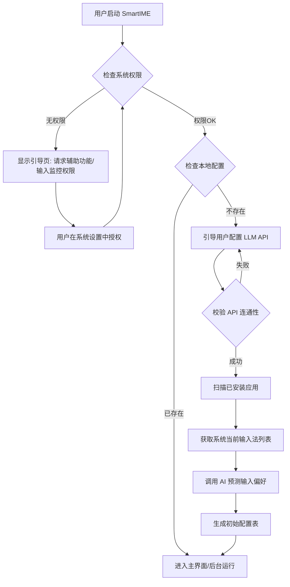
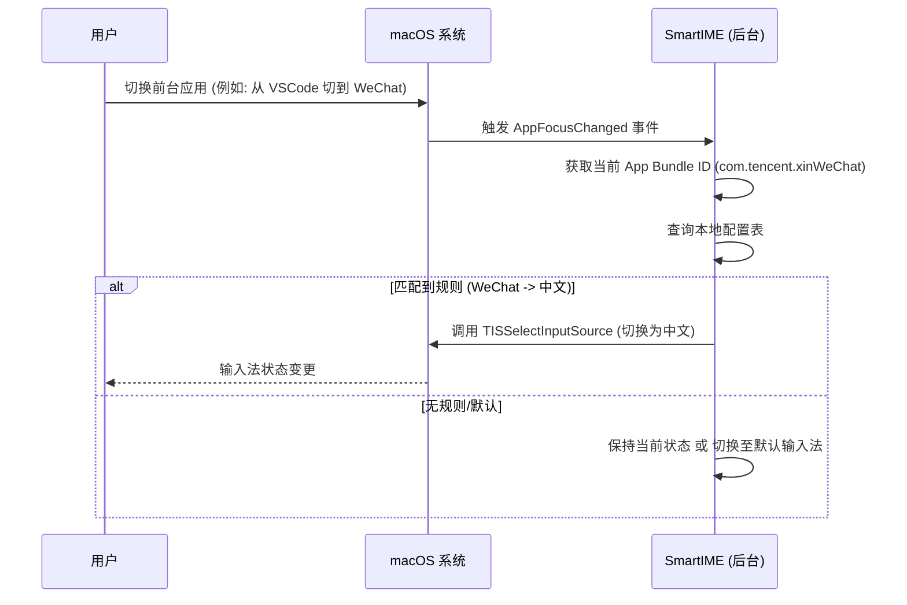

# 需求文档 (Requirements Document)

## 1. 核心需求概述

**SmartIME** 旨在解决 macOS 用户在不同应用程序间切换时，频繁手动调整输入法（中文/英文）的痛点。
通过“零配置”理念，利用 AI 辅助预判应用的输入法偏好，实现应用激活时自动切换到指定输入源，从而提升用户的输入流畅度和工作效率。

**核心价值**:
*   **自动化**: 消除手动切换输入法的操作冗余。
*   **智能化**: 利用 AI 减少用户初次设置的繁琐步骤。
*   **无感体验**: 切换过程快速、静默，不干扰用户视线。

## 2. 用户流程 (User Flows)

### 2.1 首次启动与初始化流程 (Onboarding)

### 2.2 核心功能使用流程：自动切换

### 2.3 用户手动配置流程

1.  用户点击菜单栏图标打开主界面。
2.  界面展示已识别的应用列表及当前设定的输入法（图标表示：🇨🇳 / 🇺🇸）。
3.  用户点击某个应用的输入法图标进行切换（覆盖 AI 默认设置）。
4.  配置自动保存并即时生效。
5.  (新增) 用户可在主界面点击设置图标，重新调整 LLM API 配置。

## 3. 功能性需求 (Functional Requirements)

### 3.1 核心功能
*   **FR-01 应用扫描**: 程序必须能够遍历 `/Applications` 及 `~/Applications` 目录，获取已安装应用的名称和 Bundle ID。
*   **FR-LLM LLM 配置 (新增)**:
    *   应用首次启动时，强制要求用户配置 LLM API 信息。
    *   包含字段：
        *   **API Key** (必填，掩码显示)
        *   **Model** (必填，下拉选择，默认推荐 GPT-4o 等)
        *   **Base URL** (选填，默认为 `https://api.openai.com/v1`)
    *   必须提供“连接测试”功能，验证配置有效性后方可继续。
*   **FR-02 AI 智能预测**:
    *   **前置条件**: 必须先完成 LLM API 配置。
    *   **输入限制**: 预测结果必须严格基于用户系统当前已安装/启用的输入法列表，不得虚构不存在的输入法 ID。
    *   **规则来源**: 完全依赖 LLM 进行智能推断，系统不内置任何静态白名单或预定义规则。
    *   调用 LLM API，根据应用名称/类别预测其输入法偏好。
*   **FR-03 自动切换**: 
    *   实时监听 macOS 的 `NSWorkspace` 活动应用变化通知。
    *   根据配置表，在 100ms 内完成输入法的切换调用。
*   **FR-04 状态记忆**: 如果用户在某个 App 内手动切换了输入法（通过系统快捷键），系统应选择性记录该次变更（临时覆盖或永久更新规则，需提供选项）。

### 3.2 界面功能
*   **FR-05 规则管理**: 
    *   提供可视化的列表，允许用户搜索应用、添加自定义规则、删除规则。
    *   **限制**: 用户手动修改规则时，可选的输入法列表必须从系统实时获取，不允许手动输入未知的输入法 ID。
*   **FR-06 全局开关**: 提供“暂停自动切换”的全局开关。
*   **FR-07 默认策略**: 允许设置“未匹配应用”的默认行为（保持不变 / 强制英文）。

## 4. 非功能性需求 (Non-functional Requirements)

### 4.1 性能要求
*   **响应速度**: 应用切换检测到输入法切换完成的延迟应低于 200ms，确保用户开始打字时输入法已就绪。
*   **资源占用**: 后台静默运行时，CPU 占用率应低于 1%，内存占用应低于 50MB。

### 4.2 安全性与隐私
*   **权限最小化**: 仅请求必要的“辅助功能”或“输入监控”权限。
*   **数据隐私**: 应用列表和输入习惯数据仅存储在本地，除非用户明确同意，否则不上传至云端。
*   **凭证安全**: API Key 等敏感信息必须加密存储或使用系统 Keychain 存储。

### 4.3 兼容性
*   **操作系统**: 支持 macOS 12.0 (Monterey) 及以上版本。
*   **架构**: 提供 Apple Silicon (M1/M2/M3) 和 Intel 架构的双重支持 (Universal Binary)。

### 4.4 可用性
*   **系统托盘**: 应用应常驻菜单栏，不占用 Dock 栏空间（可配置）。
*   **开机自启**: 支持配置为登录时自动启动。
*   **失败处理**: 若 LLM API 连通性校验失败，应明确提示错误原因（如 401 Unauthorized, Network Error）并允许重试。

### 4.5 分发方式
*   **Homebrew Cask**: 必须支持通过 `brew install --cask <app-name>` 进行安装和更新，以便于开发者群体快速部署。
