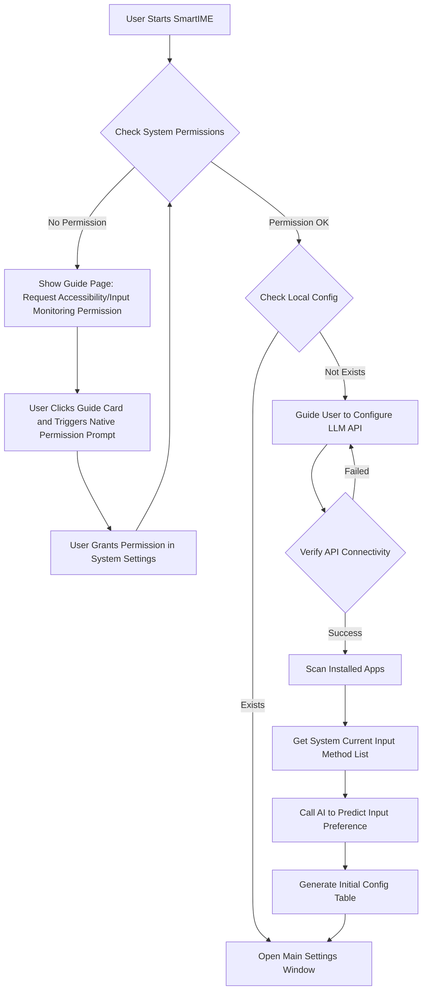
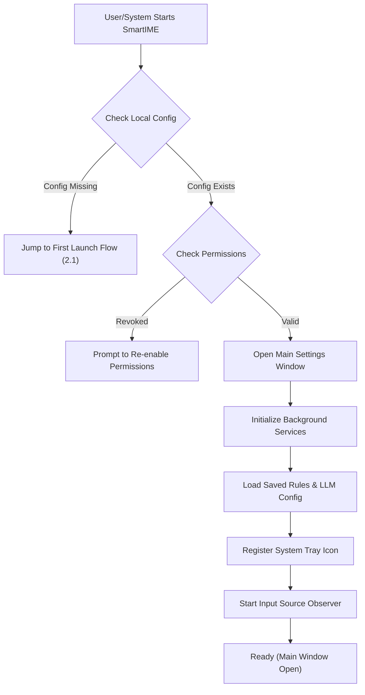
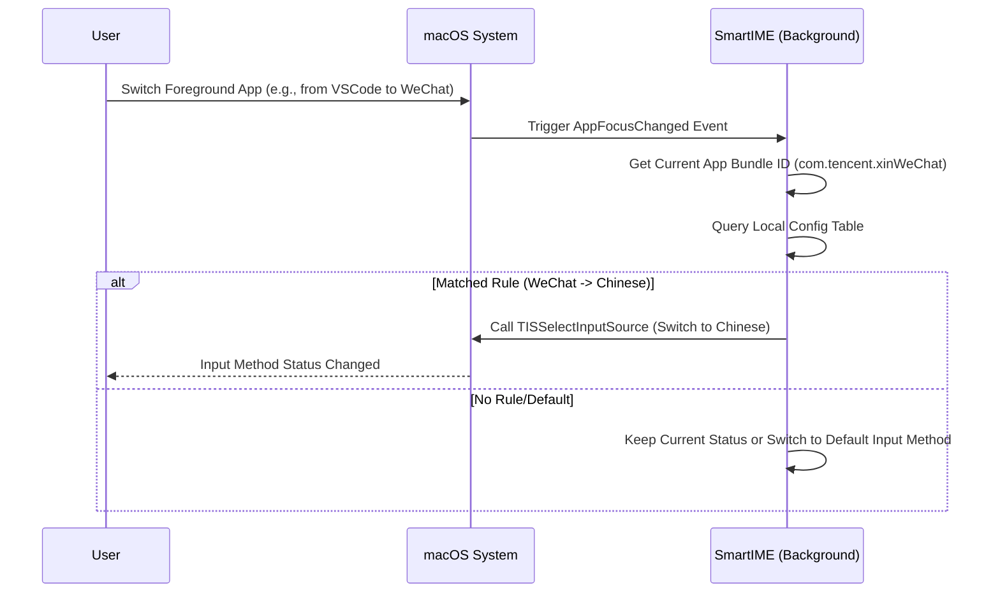

# Requirements Document

## 1. Core Requirements Overview

**SmartIME** aims to solve the pain point of frequent manual input method switching (Chinese/English) when users switch between different applications on macOS.
Through a "Zero Configuration" concept, it uses AI to assist in predicting the input method preference of applications, achieving automatic switching to the specified input source when an application is activated, thereby improving user input fluency and work efficiency.

**Core Value**:
*   **Automation**: Eliminates redundant operations of manual input method switching.
*   **Intelligence**: Uses AI to reduce the tedious steps of initial user setup.
*   **Seamless Experience**: Switching process is fast, silent, and does not interfere with the user's line of sight.

## 2. User Flows

### 2.1 First Launch & Initialization Flow (Onboarding)

### 2.2 Cold Start Flow (Subsequent Launch)

### 2.3 Core Function Usage Flow: Automatic Switching

### 2.4 User Manual Configuration Flow

This flow represents a **returning user** (not the first launch). All required permissions and LLM configuration are already completed.

1.  User opens the app and the main settings window is shown directly.
2.  When the user clicks the **menu bar icon**, the app opens the **main settings window** (same flow as a returning user; no separate popup window).
3.  Interface displays the identified application list and currently set input method (Icon representation: 🇨🇳 / 🇺🇸).
4.  User clicks the input method icon of an application to switch (Override AI default setting).
5.  Configuration is automatically saved and takes effect immediately.
6.  Settings in the main interface are for rule management and general system behavior only.

### 2.5 Permission Interaction Constraints (Onboarding)

To avoid duplicate or confusing permission behavior, onboarding permission actions are split strictly:

1.  **Guide card action** (e.g. `Settings > Privacy & Security > Accessibility`):
    *   Only triggers native Accessibility authorization prompt.
    *   Must not auto-open the Accessibility settings page in the same action.
2.  **Retry/check action** (e.g. `Permission not detected, click to retry`):
    *   Only performs permission status check (`check_permissions`).
    *   Must not trigger native authorization prompt.
3.  If authorization prompt does not appear or user dismissed it, user may manually open System Settings as fallback guidance.

### 2.6 Interaction Optimizations (Captured from Regression Testing)

The following UI/interaction changes are part of the finalized product behavior and must be preserved:

1.  **Onboarding / Permission page**
    *   Permission guide card triggers native authorization request only.
    *   Retry/check button performs permission check only.
    *   Authorization request and permission check must not implicitly trigger each other.

2.  **Main settings / Rules panel**
    *   "Rescan" loading state must remain accurate until task completion.
    *   If user navigates away during rescan, scanning continues in background and commits results.
    *   Returning to Rules panel during in-flight rescan must still show loading state.
    *   Post-onboarding redirect to Rules must not leave the view in an infinite loading state.

3.  **Main settings / General settings panel**
    *   Toggling "Hide Dock Icon" must not auto-close the main settings window.
    *   When hide-Dock mode is enabled and user closes the window, app remains alive in menu bar.
    *   Reactivation via Dock icon or tray icon should be equivalent: open existing main settings window in the same running process.
    *   "Start at login" and "Hide Dock Icon" are independent settings and must not implicitly alter each other.

## 3. Functional Requirements

### 3.1 Core Functions
*   **FR-01 App Scanning**: The program must be able to traverse `/Applications` and `~/Applications` directories to get the names and Bundle IDs of installed applications.
*   **FR-LLM LLM Configuration (New)**:
    *   On first application launch, forcibly require user to configure LLM API information.
    *   Fields included:
        *   **API Key** (Required, masked display)
        *   **Model** (Required, text input, default recommendation GPT-4o, etc.)
        *   **Base URL** (Optional, defaults to `https://api.openai.com/v1`)
    *   Must provide "Test Connection" function, allowing continuation only after valid configuration verification.
*   **FR-02 AI Intelligent Prediction**:
    *   **Precondition**: Must complete LLM API configuration first.
    *   **Input Constraint**: Prediction results must strictly be based on the user's currently installed/enabled input method list on the system, and must not fabricate non-existent input method IDs.
    *   **Rule Source**: Completely rely on LLM for intelligent inference, system does not build in any static whitelist or predefined rules.
    *   Call LLM API to predict input method preference based on application name/category.
*   **FR-03 Automatic Switching**:
    *   Real-time monitoring of macOS `NSWorkspace` active application change notifications.
    *   Complete input method switching call within 100ms based on the configuration table.
*   **FR-04 State Memory**: If the user manually switches the input method within an App (via system shortcut), at this time, pause the input method switching function provided by this application for ten minutes.

### 3.2 Interface Functions
*   **FR-05 Rule Management**:
    *   Provide a visual list allowing users to search applications, and delete rules.
    *   **Restriction**: When users manually modify rules, the selectable input method list must be obtained from the system in real-time, disallowing manual input of unknown input method IDs.
*   **FR-06 Global Switch**: Provide a global switch to "Pause Automatic Switching".
*   **FR-07 Unmatched App Policy**:
    *   Unmatched applications use fixed behavior: keep current input source unchanged.
    *   No separate user-facing setting for unmatched application policy is required in General Settings.
*   **FR-08 General Settings**:
    *   Provide toggles for **Auto-start at login** and **Hide Dock icon**.
    *   Changes must persist across restarts and take effect at the system level.
*   **FR-09 Manual Rescan**:
    *   Provide a "Rescan" action in the Rules view (localized label may be `重新扫描`) to refresh installed app list and re-run AI prediction, and in this process, the input method switching function is temporarily paused.
    *   Must show a loading state and prevent duplicate triggers while scanning.
    *   If user switches to another settings panel during scanning, scan must continue in background and final result must still be committed.
    *   When user returns to Rules panel before completion, loading state must still be visible until scan is done.
*   **FR-10 Permission Action Separation**:
    *   Onboarding guide card triggers authorization request only.
    *   Retry/check button performs permission verification only.
    *   These two actions must not invoke each other implicitly.
*   **FR-11 Scan Result Consistency**:
    *   In both first-run onboarding scan and later manual rescans, the in-app application list must reflect current installed applications in `/Applications` and `~/Applications`.
    *   In both first-run onboarding scan and later manual rescans, the in-app input method list must reflect current enabled system input sources.
    *   Input methods removed from the system must be pruned from in-app selectable options and rule data.
*   **FR-12 Single-Instance Reactivation Semantics**:
    *   All app entry points (launch, Dock icon, tray icon, login-item startup) must resolve to one running process.
    *   If process already exists, reactivation should focus/open the existing main settings window instead of spawning duplicate UI/process representations.
*   **FR-13 General Settings Independence**:
    *   `autoStart` and `hideDockIcon` must be implemented as independent persisted preferences.
    *   Updating one setting must not implicitly mutate the other setting.

## 4. Non-functional Requirements

### 4.1 Performance Requirements
*   **Response Speed**: The latency from detecting application switch to completing input method switch should be less than 200ms, ensuring the input method is ready when the user starts typing.
*   **Resource Usage**: When running silently in the background, CPU usage should be less than 1%, and memory usage should be less than 50MB.

### 4.2 Security & Privacy
*   **Permission Minimization**: Only request necessary "Accessibility" or "Input Monitoring" permissions.
*   **Data Privacy**: Application lists and input habit data are stored locally only and are not uploaded to the cloud unless explicitly agreed by the user.
*   **Credential Security**: Sensitive information like API Keys must be stored encrypted or using the System Keychain.

### 4.3 Compatibility
*   **Operating System**: Supports macOS 12.0 (Monterey) and above.
*   **Architecture**: Provides dual support for Apple Silicon (M1/M2/M3) and Intel architectures (Universal Binary).

### 4.4 Usability
*   **System Tray**: Application should reside in the menu bar and not occupy Dock space (Configurable).
*   **Auto-start**: Supports configuration to start automatically at login.
*   **Failure Handling**: If LLM API connectivity check fails, clear error reasons (such as 401 Unauthorized, Network Error) should be prompted and retry allowed.

### 4.5 Distribution Method
*   **Homebrew Cask**: Must support installation and update via `brew install --cask <app-name>` to facilitate rapid deployment by the developer community.
