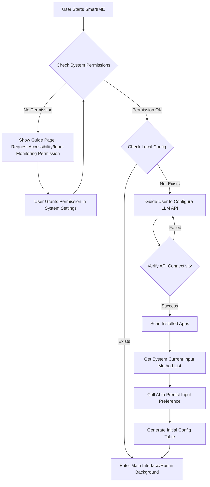

# Requirements Document

## 1. Core Requirements Overview

**SmartIME** aims to solve the pain point of frequent manual input method switching (Chinese/English) when users switch between different applications on macOS.
Through a "Zero Configuration" concept, it uses AI to assist in predicting the input method preference of applications, achieving automatic switching to the specified input source when an application is activated, thereby improving user input fluency and work efficiency.

**Core Value**:
*   **Automation**: Eliminates redundant operations of manual input method switching.
*   **Intelligence**: Uses AI to reduce the tedious steps of initial user setup.
*   **Seamless Experience**: Switching process is fast, silent, and does not interfere with the user's line of sight.

## 2. User Flows

### 2.1 First Launch & Initialization Flow (Onboarding)

### 2.2 Core Function Usage Flow: Automatic Switching

### 2.3 User Manual Configuration Flow

1.  User clicks the menu bar icon to open the main interface.
2.  Interface displays the identified application list and currently set input method (Icon representation: 🇨🇳 / 🇺🇸).
3.  User clicks the input method icon of an application to switch (Override AI default setting).
4.  Configuration is automatically saved and takes effect immediately.
5.  (New) User can click the settings icon in the main interface to readjust LLM API configuration.

## 3. Functional Requirements

### 3.1 Core Functions
*   **FR-01 App Scanning**: The program must be able to traverse `/Applications` and `~/Applications` directories to get the names and Bundle IDs of installed applications.
*   **FR-LLM LLM Configuration (New)**:
    *   On first application launch, forcibly require user to configure LLM API information.
    *   Fields included:
        *   **API Key** (Required, masked display)
        *   **Model** (Required, dropdown selection, default recommendation GPT-4o, etc.)
        *   **Base URL** (Optional, defaults to `https://api.openai.com/v1`)
    *   Must provide "Test Connection" function, allowing continuation only after valid configuration verification.
*   **FR-02 AI Intelligent Prediction**:
    *   **Precondition**: Must complete LLM API configuration first.
    *   **Input Constraint**: Prediction results must strictly be based on the user's currently installed/enabled input method list on the system, and must not fabricate non-existent input method IDs.
    *   **Rule Source**: Completely rely on LLM for intelligent inference, system does not build in any static whitelist or predefined rules.
    *   Call LLM API to predict input method preference based on application name/category.
*   **FR-03 Automatic Switching**:
    *   Real-time monitoring of macOS `NSWorkspace` active application change notifications.
    *   Complete input method switching call within 100ms based on the configuration table.
*   **FR-04 State Memory**: If the user manually switches the input method within an App (via system shortcut), the system should selectively record this change (temporary override or permanent rule update, options needed).

### 3.2 Interface Functions
*   **FR-05 Rule Management**:
    *   Provide a visual list allowing users to search applications, add custom rules, and delete rules.
    *   **Restriction**: When users manually modify rules, the selectable input method list must be obtained from the system in real-time, disallowing manual input of unknown input method IDs.
*   **FR-06 Global Switch**: Provide a global switch to "Pause Automatic Switching".
*   **FR-07 Default Policy**: Allow setting default behavior for "Unmatched Applications" (Keep Unchanged / Force English).

## 4. Non-functional Requirements

### 4.1 Performance Requirements
*   **Response Speed**: The latency from detecting application switch to completing input method switch should be less than 200ms, ensuring the input method is ready when the user starts typing.
*   **Resource Usage**: When running silently in the background, CPU usage should be less than 1%, and memory usage should be less than 50MB.

### 4.2 Security & Privacy
*   **Permission Minimization**: Only request necessary "Accessibility" or "Input Monitoring" permissions.
*   **Data Privacy**: Application lists and input habit data are stored locally only and are not uploaded to the cloud unless explicitly agreed by the user.
*   **Credential Security**: Sensitive information like API Keys must be stored encrypted or using the System Keychain.

### 4.3 Compatibility
*   **Operating System**: Supports macOS 12.0 (Monterey) and above.
*   **Architecture**: Provides dual support for Apple Silicon (M1/M2/M3) and Intel architectures (Universal Binary).

### 4.4 Usability
*   **System Tray**: Application should reside in the menu bar and not occupy Dock space (Configurable).
*   **Auto-start**: Supports configuration to start automatically at login.
*   **Failure Handling**: If LLM API connectivity check fails, clear error reasons (such as 401 Unauthorized, Network Error) should be prompted and retry allowed.

### 4.5 Distribution Method
*   **Homebrew Cask**: Must support installation and update via `brew install --cask <app-name>` to facilitate rapid deployment by the developer community.
